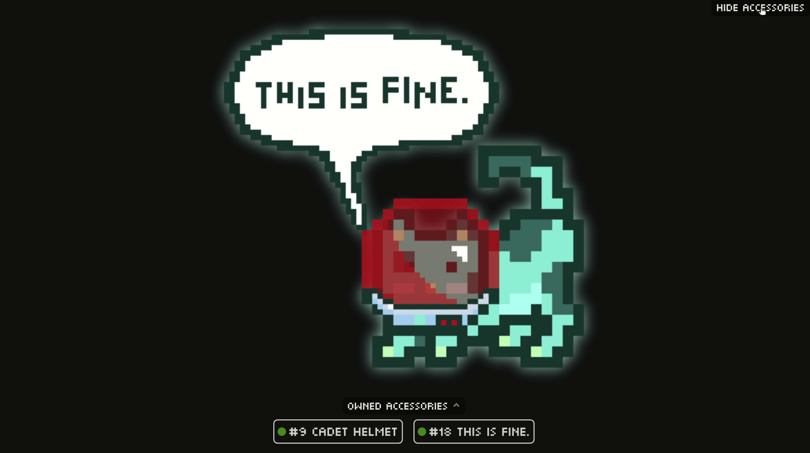
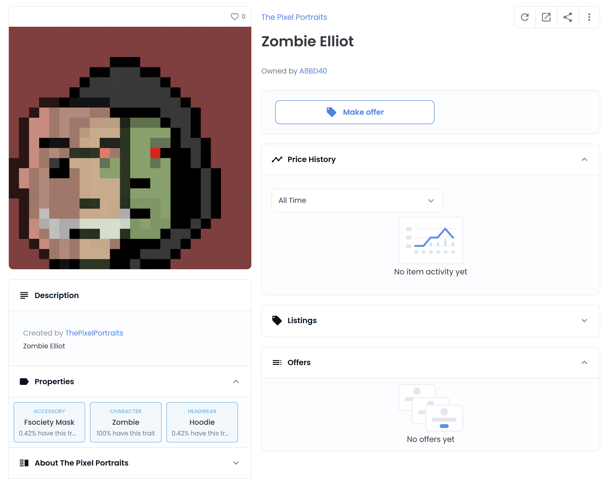
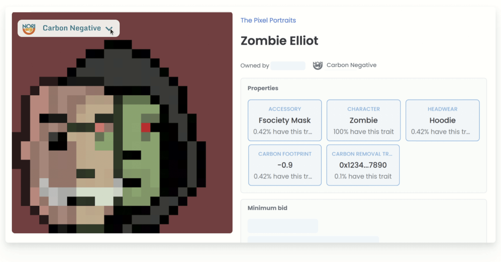

I think about NFTs a lot. [Since 2017](https://github.com/nori-dot-eco/NIPs/issues/4), I've [toyed](https://jaycen.io/Atomic-Swap-Marketplaces-for-Non-Fungible-Tokens/) with the seemingly endless use-cases of NFTs and watched as others did the same. It's been amazing to see the world unleash value, art and utility in ways that could have once been seen as outright crazy: CryptoPunks worth millions, OpenSea logging [billions of dollars in volume](https://decrypt.co/79789/opensea-3b-month-ethereum-nft-sales-amazon-ebay-etsy), Axie Infinity fueling [the play-to-earn revolution in gaming](https://www.notboring.co/p/infinity-revenue-infinity-possibilities), ENS completely reinventing the way we interact with web3, and so many more things. Honestly, it has been hard to keep up.

Now that we have all of these fascinating NFTs on-chain though, it's time to level them up by introducing them to one another. NFTs completely decouple value from function which allows us to do things like mash up two completely unrelated NFTs, transport an NFT from one metaverse to another, and so much more. This is called composability and it's the obvious next phase for NFTs. 

There are endless examples of composability, but I can't think of a better way than one that also addresses one of the loudest controversies surrounding NFTs-- [their carbon footprint](https://medium.com/nori-carbon-removal/carbon-removal-nfts-are-the-solution-to-energy-usage-and-carbon-emissions-from-blockchain-crypto-a13e4d521245). I'm talking about composing NFTs with other NFTs to make them carbon negative. Let's break that down.

First, let's talk a bit about composability. Composability is [not a new idea](https://a16z.com/2018/12/16/4-eras-of-blockchain-computing-degrees-of-composability/)-- not even for [NFTs](https://github.com/ethereum/EIPs/issues/998). In fact, you can see some examples of this throughout the metaverse today. For example, let's take a look at [this](https://api.mooncat.community/dynamic/0x003b92f2eb) accessorized MoonCat NFT:

 

See that cadet helmet and "This is Fine" speech bubble? That MoonCat didn't start out with those. Instead, those accessories are [standalone NFTs](https://mooncat.community/accessory-faq) that actually live in their own smart contract apart from the MoonCat. What we see in the image above however is the output of the composition of the MoonCat NFT with the accessory NFTs. Further, what's interesting here is that the MoonCat NFT is a fully interactive NFT. Want to view the original MoonCat without accessories? Just click the "hide accessories" button [here ](https://api.mooncat.community/dynamic/0x003b92f2eb).

There are many different approaches to NFT composability out there, but for the sake of simplicity I'm going to explore composing NFTs using the existing [NFT metadata standard](https://eips.ethereum.org/EIPS/eip-721) so that everything I explore is fully compatible with a majority of NFTs in existence today. Whether you launched an NFT yesterday, will mint one tomorrow, developed a wallet that displays them, or even run an NFT marketplace, all of the concepts introduced are compatible with how things work today.


Now that we've gone over composability, let's talk about the other side of the equation: how carbon negative footprints work. When an NFT is minted, we can use the methodology I covered in [this post](https://jaycen.io/Ethereum-Smart-Contract-Footprint-Calculator/) to calculate that transaction's footprint. For NFTs, this footprint can vary based on many different factors, so for this now let's take one of my own NFTs as an example. Meet ["Zombie Elliot"](https://opensea.io/assets/0xa8121b153c77ca4dd1da3a9d7cdc4729129c8c6d/169):


Minting Zombie Elliot had an approximate footprint of 0.1 tonnes of CO2. This means that if I wanted to zero out the footprint of this NFT, I would need to remove 0.1 tonnes of CO2 from the atmosphere. However, to make this NFT carbon *negative*, I would need to go beyond that and remove *more than* 0.1 tonnes of CO2. However, removing this much CO2 personally is non-trivial. As such, what I can do instead is pay someone else who *can* remove it to do so. The best way I know how to do this is by [purchasing an on-chain carbon removal certificate](https://nori.com/remove-carbon) called a Nori Removal Tonne (NRT). Importantly, this NRT is itself also an NFT which means we can compose the two together. To illustrate this example, I've gone ahead and purchased 1 NRT-- you can view the NFT [here](https://etherscan.io/tx/0x8673b5b3e74f5875d11b48c6c4392793bff490fc0f0d3b6547dbc7bc478ef455), or the more user-friendly certificate [here](https://nori.com/certificate/786).

Finally, let's go over how NFTs work today and what we can do to compose Zombie Elliot with an NRT to make it Carbon Negative. 

Today, most NFTs rendered in wallets, marketplaces, and elsewhere use the NFT metadata standard. NFTs that follow this standard assign a URI that commonly resolves to JSON data that describes each individual NFT. Inside, this data includes an image of the NFT as well as its attributes (e.g., for Zombie Elliot, that data would include a "zombie" attribute). Let's take a look at the JSON data for Zombie Elliot:

```json
{
  "name": "Zombie Elliot",
  "description": "Zombie Elliot",
  "image": "https://pixels-commissions.s3.eu-west-1.amazonaws.com/%23166%20elliot%20copy.png",
  "attributes": [
    { "trait_type": "character", "value": "zombie" },
    { "trait_type": "accessory", "value": "fsociety mask" },
    { "trait_type": "headwear", "value": "hoodie" }
  ],
}
```

In the above data, the image property points to this URI: `https://pixels-commissions.s3.eu-west-1.amazonaws.com/%23166%20elliot%20copy.png`. This data is what allows wallets and marketplaces to render the NFT. For example, [this](https://opensea.io/assets/0xa8121b153c77ca4dd1da3a9d7cdc4729129c8c6d/169) is how OpenSea renders that data today:



Looking at the above, all we need to do is figure out how to tweak the data above so that our NFT flaunt a carbon negative badge. Doing so is as easy as adding the following data to the attributes in the above JSON:


```json
{ 
  "trait_type": "carbon footprint", 
  "value": -0.9 
},
{ 
  "trait_type": "carbon removal transaction", 
  "value": "0x8673b5b3e74f5875d11b48c6c4392793bff490fc0f0d3b6547dbc7bc478ef455" 
},
```

Finally, to we want to take it one step further, we can use the `animation_url` property of the metadata to allow viewers to interact with the details of Zombie Elliot's footprint (this is the same property that powers the MoonCat accessories covered earlier). 

Here's what that end result might look like:



That's it! Using this approach, anyone can compose their NFTs with on-chain carbon removal to make them entirely carbon negative!


###### *Big thank-you to [Amanda Yee](https://twitter.com/amandayee_) for help with the mocks!*


